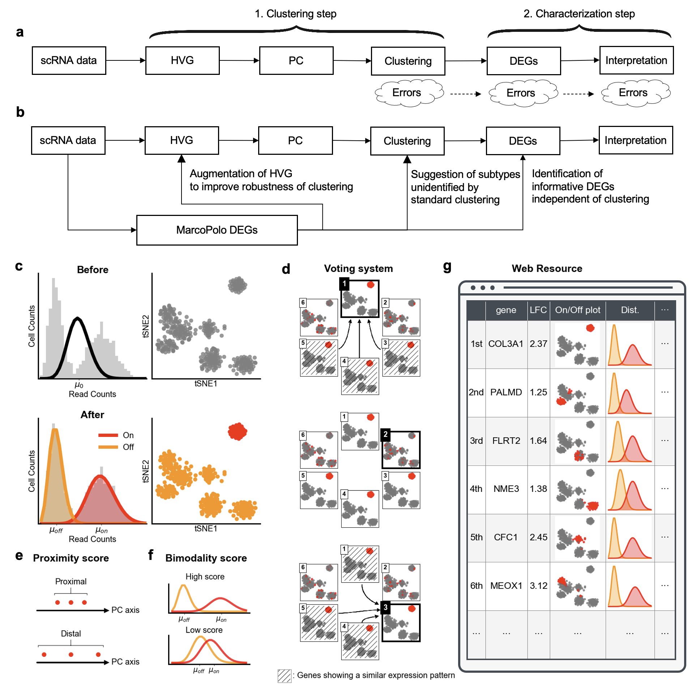

MarcoPolo is a clustering-free approach to the exploration of differentially expressed genes along with group information in single-cell RNA-seq data


# Overview





`MarcoPolo` is a novel clustering-free approach to identifying differentially expressed genes in scRNA data. In addition to predicting DEGs more accurately than previous methods, we aim to tell which groups of cells ‘differentially’ express the identified genes. Thus, the two main functions of our method are to sort out genes with biologically informative expression patterns with high precision without clustering and to learn tentative grouping of the cells with respect to the expression level directly from the given data. As our method does not demand prior group information of cells in advance, our approach is robust to uncertainties from clustering or cell type assignment. 

)<br>

`MarcoPolo` disentangles the bimodality inherent in gene expression and divides cells into two groups by maximum likelihood estimation under a mixture model. This figure shows how cells in real datasets were divided by `MarcoPolo` for each of four exemplary genes. For these genes shown, a certain cell type showed higher expression than other cell types. `MarcoPolo` successfully identified them as a separate group.

# Advantages of using MarcoPolo
* to sort out DEGs highly accurately
* to identify cell types in the given data without the help of a clustering algorithm
    * MarcoPolo can identify cell types that are not separated well in the standard clustering process
* to select genes as input features for the dimensionality reduction step 
    * If you use the biologically feasible genes identified by MarcoPolo as input for dimensionality reduction, you can obtain better clustering results


# Paper

For more information, please refer to our paper.

Chanwoo Kim, et al. MarcoPolo: a clustering-free approach to the exploration of bimodally expressed genes along with group information in single-cell RNA-seq data. 

# MarcoPolo report
Our framework provides the analysis result in the form of an HTML file, so that researchers can conveniently interpret and make use of the result for various purposes. The reports using the datasets included in our paper are as follows.

|Datasets|URL|
|:---|:---|
|Human liver cells (MacParland et al.)|[https://ch6845.github.io/MarcoPolo/HumanLiver/](https://ch6845.github.io/MarcoPolo/HumanLiver/)|
|Human embryonic stem cells (The Koh et al.)|[https://ch6845.github.io/MarcoPolo/hESC/](https://ch6845.github.io/MarcoPolo/hESC/)|
|Peripheral blood mononuclear cells (Zheng et al.)|[https://ch6845.github.io/MarcoPolo/Zhengmix8eq/](https://ch6845.github.io/MarcoPolo/Zhengmix8eq/)|


# How to install

Currently, `MarcoPolo` was tested only on Linux machines.
Dependencies are as follows:
* `python` (3.7)
    * `numpy` (1.19.5)
    * `pandas` (1.2.1)
    * `scipy` (1.6.0)
    * `scikit-learn` (0.24.1)
    * `pytorch` (1.4.0)
* `R` (4.0.3)
    * `Seurat` (3.2.1)
    * `scran` (1.18.3)
    * `Matrix` (1.3.2)
    * `SingleCellExperiment` (1.12.0)

Download MarcoPolo by `git clone`
```
git clone https://github.com/ch6845/MarcoPolo.git
```

We recommend using the following pipeline to install the dependencies.

1. Install Anaconda
Please refer to https://docs.anaconda.com/anaconda/install/linux/
make conda environment and activate it
```
conda create -n MarcoPolo python=3.7
conda activate MarcoPolo
```

2. Install Python packages
```
pip install numpy=1.19.5 pandas=1.21 scipy=1.6.0 scikit-learn=0.24.1
```
Also, please install `PyTorch` from https://pytorch.org/ (If you want to install CUDA-supported PyTorch, please install CUDA in advance)

3. Install R and required packages
```
conda install -c conda-forge r-base=4.0.3
```
In R, run the following commands to install packages.
```
install.packages("devtools")
devtools::install_version(package = 'Seurat', version = package_version('3.2.1'))
install.packages("Matrix")
install.packages("BiocManager")
BiocManager::install("scran")
BiocManager::install("SingleCellExperiment")
```

# Getting started

1. If you have a Seurat object `seurat_object`, you can save it to a Python-readable file format as follows. Files with prefix `scRNAdata` are generated

```
save_sce <- function(sce,path,lowdim='TSNE'){
    
    sizeFactors(sce) <- calculateSumFactors(sce)
    
    save_data <- Matrix(as.matrix(assay(sce,'counts')),sparse=TRUE)
    
    writeMM(save_data,sprintf("%s.data.counts.mm",path))
    write.table(as.matrix(rownames(save_data)),sprintf('%s.data.row',path),row.names=FALSE, col.names=FALSE)
    write.table(as.matrix(colnames(save_data)),sprintf('%s.data.col',path),row.names=FALSE, col.names=FALSE)
    
    tsne_data <- reducedDim(sce, lowdim)
    colnames(tsne_data) <- c(sprintf('%s_1',lowdim),sprintf('%s_2',lowdim))
    print(head(cbind(as.matrix(colData(sce)),tsne_data)))
    write.table(cbind(as.matrix(colData(sce)),tsne_data),sprintf('%s.metadatacol.tsv',path),row.names=TRUE, col.names=TRUE,sep='\t')    
    write.table(cbind(as.matrix(rowData(sce))),sprintf('%s.metadatarow.tsv',path),row.names=TRUE, col.names=TRUE,sep='\t')    
    
    write.table(sizeFactors(sce),file=sprintf('%s.size_factor.tsv',path),sep='\t',row.names=FALSE, col.names=FALSE)    

}

sce_object <- as.SingleCellExperiment(seurat_object)
save_sce(sce_object, 'scRNAdata')

```

2. Run MarcoPolo analysis as follows.
```
import MarcoPolo.QQscore as QQ
import MarcoPolo.summarizer as summarizer

path='scRNAdata'
QQ.save_QQscore(path=path,device='cuda:0')
allscore=summarizer.get_MarcoPolo(path=path)
allscore.to_csv('{path}.MarcoPolo.2.rank.tsv'.format(path=path),sep='\t')  
```
